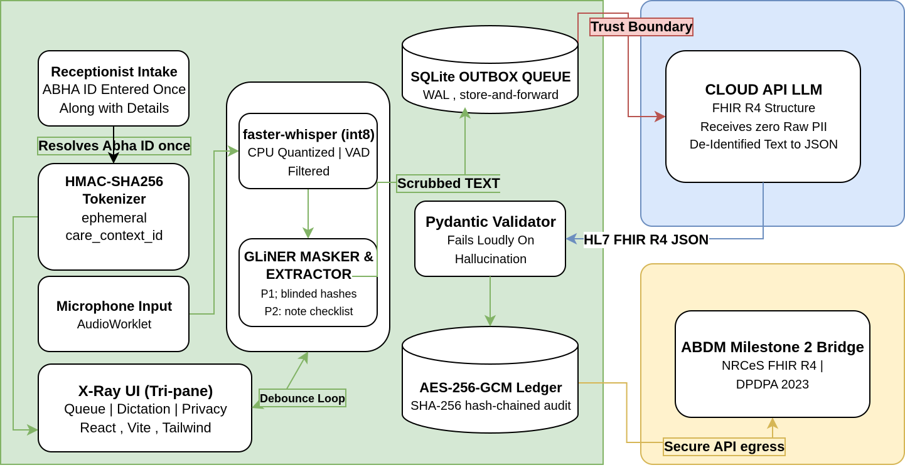

<div align="center">

# 🩺 S.P.E.A.K.

### Secure Patient Extraction & Anonymization Kernel

**Local edge voice-to-structured-record workflow for clinical consultations**

*Smart India Hackathon 2026 · Team OPSEC*

[](https://github.com/JustJoyful/medsync-proto)
[](backend/main.py)
[](frontend/package.json)
[](backend/pipeline/fhir_schema.py)

</div>

## Overview

S.P.E.A.K. combines a React/Vite doctor workspace with a FastAPI edge service. A clinician selects or creates an encounter, types or dictates a note, and receives transcript and checklist updates while the backend keeps queue and encounter state in SQLite. When an encounter is finalized, the backend masks supported PII patterns, queues the sanitized transcript, structures it as an NRCeS-aligned outpatient record, validates it with Pydantic, encrypts it with AES-256-GCM, and stores the result locally. An optional OpenAI-compatible or DeepSeek request can perform the structuring step; a local rule-based structurer is used when no LLM key is configured.

## The Problem / Our Approach

- **Documentation workload:** provide one workspace for queue selection, microphone dictation, typed notes, transcript editing, and record review.
- **Local edge processing:** stream 16 kHz PCM to the local encounter WebSocket and run faster-whisper with VAD and confidence filtering on the edge node.
- **Identity context:** create a local care-context ID and salted HMAC-SHA256 ABHA hash at reception, while the doctor workflow uses encounter tokens.
- **Controlled data egress:** mask the finalized transcript before the optional HTTP structuring request and keep encrypted records in the local database.

## Architecture




The browser talks to the local FastAPI service through HTTP, WebSocket, and SSE routes. Finalization calls the masking pipeline before the pending transcript is processed; only the sanitized clinical text is eligible for the optional external structuring request. The resulting validated record is encrypted and written to the local SQLite encounter store.

## Tech Stack

| Layer | Technology | Role |
|---|---|---|
| API service | FastAPI, Uvicorn | Serves health, queue, encounter, SSE, and WebSocket routes (backend/main.py). |
| Browser client | React, React DOM, Vite | Renders the clinical workspace and development/build server (frontend/src/main.jsx, frontend/vite.config.js). |
| Styling | Tailwind CSS, @tailwindcss/vite | Provides utility classes and theme tokens (frontend/src/index.css). |
| UI utilities | lucide-react, clsx, tailwind-merge | Icons and conditional Tailwind class composition. |
| Audio capture | Web Audio API, AudioWorklet | Converts microphone frames to 16 kHz signed PCM before WebSocket transmission (frontend/public/audio-processor.js). |
| Speech-to-text | faster-whisper, NumPy | Runs CPU transcription with VAD, phrase buffering, and confidence/hallucination filters (backend/pipeline/stt.py). |
| PII masking | GLiNER, Python re | Detects person entities and masks configured ABHA, Aadhaar, phone, and PIN patterns (backend/pipeline/pii_mask.py). |
| Checklist extraction | Python re | Detects symptoms, diagnoses, medications, and advice in cumulative text (backend/pipeline/checklist.py). |
| Data models | Pydantic | Validates queue, care-context, outpatient-record, encrypted-bundle, and sync-pointer models (backend/pipeline/fhir_schema.py). |
| Local database | Python sqlite3 | Persists queues, local care-context mappings, transcripts, encrypted encounters, and the ledger (backend/db/local.py). |
| Encryption | cryptography / AESGCM | Encrypts structured record JSON and separates ciphertext, nonce, and authentication tag (backend/pipeline/crypto.py). |
| HTTP client | httpx | Performs optional LLM requests and the sync worker connectivity check (backend/pipeline/llm_structurer.py, backend/pipeline/sync_poller.py). |

## Key Features

- **Queue and reception flow:** /queue/today, /queue/seed, /queue/add, and /queue/{token}/status support daily queue retrieval, demo seeding, patient intake, and status changes (backend/routes/reception.py).
- **Scheduled and walk-in encounters:** doctors can select a queued token or create an unscheduled encounter with a name and complaint (backend/routes/encounter.py, frontend/src/components/DictationPanel.jsx).
- **Live dictation:** the browser captures microphone audio, sends PCM frames over /encounter/{token}/audio-stream, and receives TRANSCRIPT_CHUNK messages (frontend/src/hooks/useAudioStreamer.js).
- **Typed notes and editing:** the dictation panel accepts direct text, supports editing after capture, and offers local discard/reset behavior (frontend/src/components/DictationPanel.jsx, frontend/src/hooks/useTranscriptDebouncer.js).
- **Passive note checklist:** transcript patterns update Symptoms, Diagnosis, Medication, and Advice states in the checklist panel; partial text is also submitted to the encounter route (frontend/src/components/ChecklistPanel.jsx, backend/pipeline/checklist.py).
- **Privacy X-Ray:** the UI displays pipeline stages, PII events, counters, validation state, encryption state, and hash-chain telemetry (frontend/src/components/XrayLog.jsx, backend/events/bus.py).
- **Finalization and encryption:** finalization masks the cumulative transcript and marks it for asynchronous structuring; the worker validates, encrypts, stores, and hash-links the resulting record (backend/routes/encounter.py, backend/pipeline/sync_poller.py).
- **Record viewer:** completed records can be opened as a clinical summary or raw JSON, including normalization for standard FHIR Bundle entries (frontend/src/components/RecordViewer.jsx).
- **Connectivity and UI state:** the client exposes queue loading/errors, online/offline status, SSE connection handling, light/dark theme switching, and a queue-column resize preference (frontend/src/App.jsx, frontend/src/components/SyncBadge.jsx).

## Feasibility

The backend runs as a Python process with SQLite storage. The frontend runs as a Vite development server or a static production build. Whisper and GLiNER models load lazily when their paths are first used, avoiding model initialization during FastAPI startup. The local structurer requires no cloud credential; external LLM calls are optional and use HTTP only when a supported key is supplied. Audio capture additionally requires a browser with microphone and AudioWorklet support.

The sync worker polls every 10 seconds, checks connectivity, processes pending records, and publishes progress to the event bus. The current repository contains backend tests covering authentication, care-context hashing, PII masking, FHIR models, encryption/hash integrity, queue/session behavior, startup seeding, LLM structuring, and STT buffering/filtering.

## Impact

- **Frontline clinicians:** get a token-based queue, a dictation surface, live note-completeness feedback, and a structured-record viewer in one screen.
- **Clinics with intermittent connectivity:** retain queue and pending encounter data locally while the background worker waits for connectivity before processing pending records.
- **Health-data engineering teams:** get separate modules for intake, session state, speech processing, masking, validation, encryption, event streaming, and persistence that can be tested independently.

## Standards & References

- **HL7 FHIR R4:** the backend defines an outpatient consultation record model with a Bundle/document type, patient care-context reference, complaints, vitals, diagnoses, medications, and advice (backend/pipeline/fhir_schema.py).
- **NRCeS / ABDM terminology:** the model and structuring prompt identify the record as an NRCeS-aligned outpatient subset; a complete ABDM bridge is not part of the current code.
- **DPDPA:** privacy and data-minimization goals inform the local masking and storage design, but legal compliance is not a substitute for deployment-specific review.

## Getting Started

### Prerequisites

- Python 3 with the venv module
- Node.js and npm
- A browser with microphone permission and AudioWorklet support for live dictation

From a fresh clone:

```bash
git clone https://github.com/JustJoyful/medsync-proto.git
cd medsync-proto
cp .env.example .env

python3 -m venv .venv
.venv/bin/python -m pip install --upgrade pip
.venv/bin/python -m pip install -r backend/requirements.txt

npm --prefix frontend ci
```

Set the runtime encryption key before finalizing an encounter. The following generates a fresh base64-encoded 256-bit key using only Python's standard library:

```bash
printf '\\nAES_ENCRYPTION_KEY=%s\\n' "$(python3 -c 'import base64, secrets; print(base64.b64encode(secrets.token_bytes(32)).decode())')" >> .env
```

Run the services in separate terminals from the repository root:

```bash
# Terminal 1
PYTHONPATH=. .venv/bin/python -m uvicorn backend.main:app --host 0.0.0.0 --port 8000
```

```bash
# Terminal 2
npm --prefix frontend run dev
```

Open http://localhost:3000. The client defaults to http://localhost:8000; set VITE_MEDSYNC_API_URL when the edge service uses another URL.

The bundled launcher starts both services and requires curl, fuser, and nc:

```bash
./run_demo.sh
```

Build the frontend production bundle:

```bash
npm --prefix frontend run build
```

## Team

| Name | Role |
|---|---|
| _Add name_ | _Add role_ |
| _Add name_ | _Add role_ |
| _Add name_ | _Add role_ |


